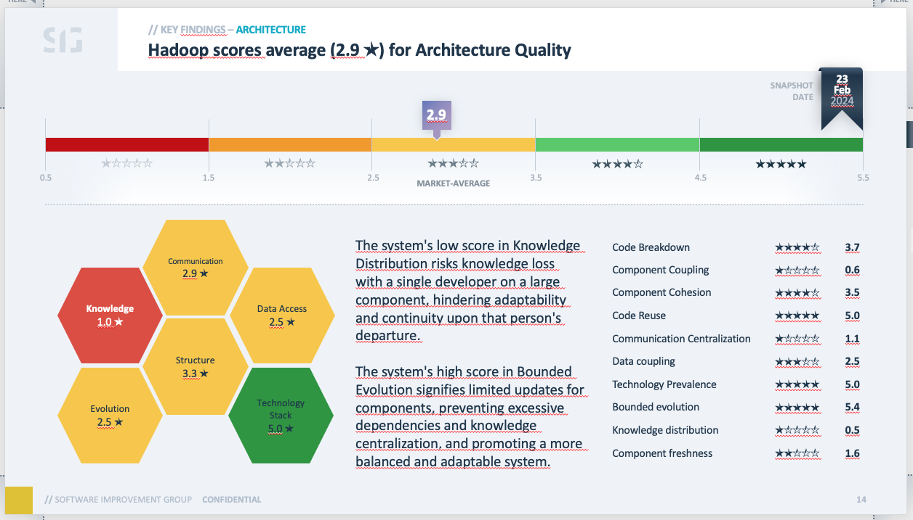
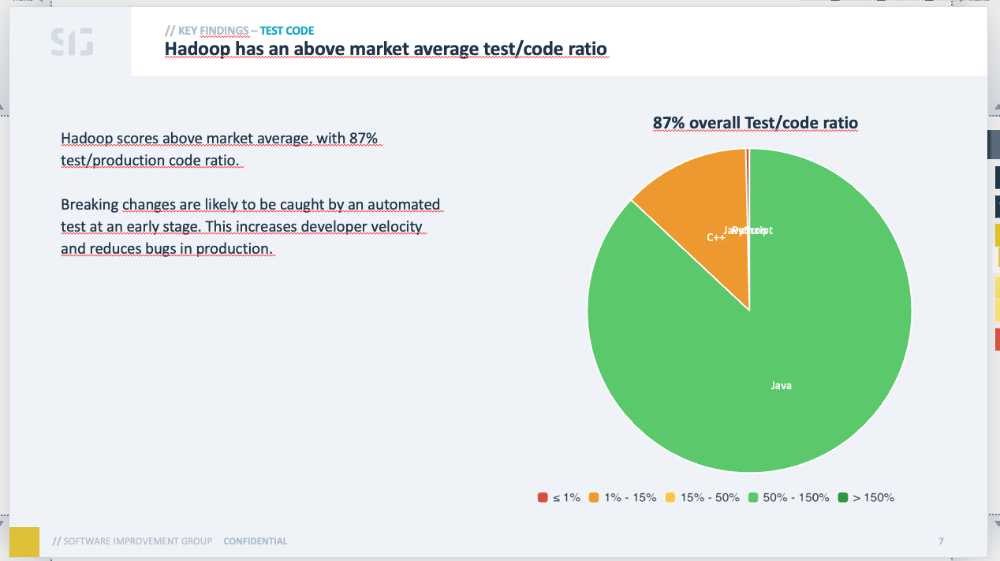
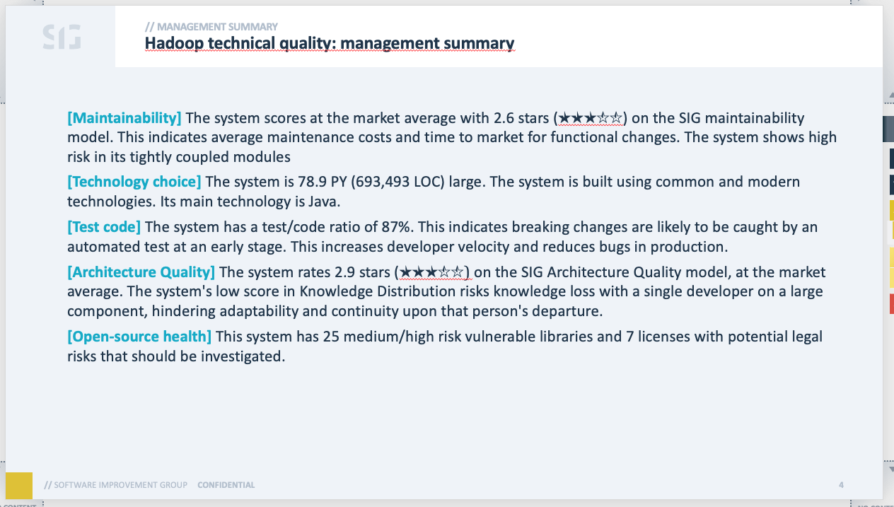
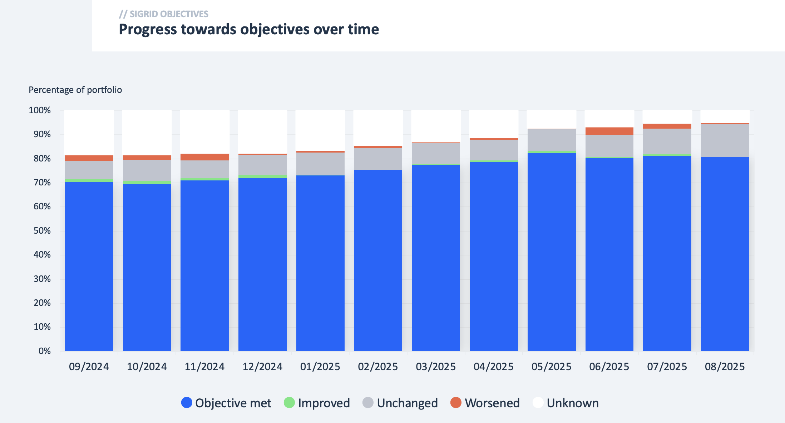
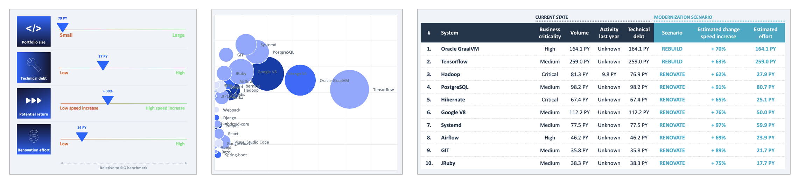
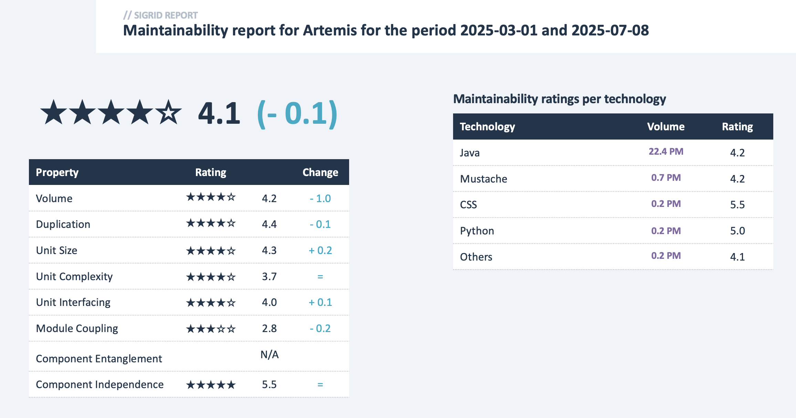
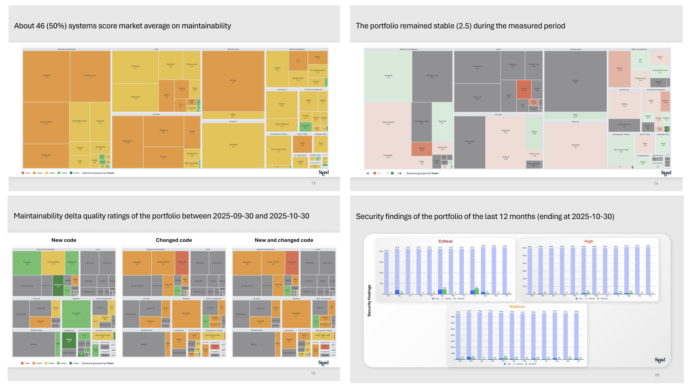
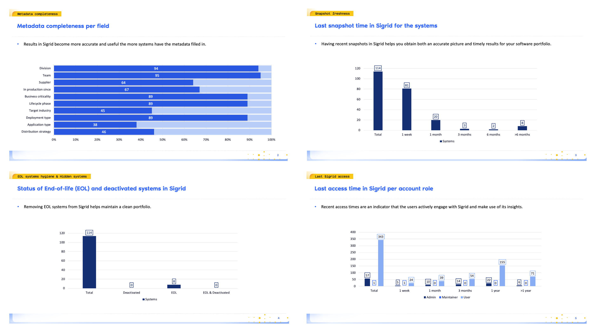

> **Upgrading from a previous version?** CLI users can just reinstall. If you use custom templates or the Python API
> directly, see the [upgrade guide](docs/upgrade-v1.md).

# Sigrid Report Generator

The Sigrid Report Generator is a tool/framework designed to generate any kind of report that is based on data
provided by Sigrid. The Report Generator can be used for two "flavors" of report:

- Standard reports provided by SIG.
- Your own custom reports, which use your own Word/PowerPoint templates.




## Prerequisites

- Python 3.10+
- You need to be able to install and use Python packages
- You need a [Sigrid API token](https://docs.sigrid-says.com/organization-integration/authentication-tokens.html)

## One-step installation

```
pip3 install git+https://github.com/Software-Improvement-Group/sigrid-report-generator.git
```

## Alternative: clone the repo and install

1. Clone this repository and `cd` into it.
2. Install the tool itself: `pip3 install -e .`.
    - If this fails with an error message that says something like "error: can't create or remove files in install
      directory", try adding `--user` to the above command.
    - If this fails with an error message saying something like "error: externally-managed-environment", try installing
      in a `venv` (Virtual environment). If you don't know how that works, ask for help.

## Usage

1. For the default report, use: `report-generator -c <your-customer> -s <your-system> -t <your-sigrid-token>`
2. If you want to provide your own custom report `.pptx` or `.docx` file. Use:
   `report-generator -p <your-file.pptx> -c <your-customer> -s <your-system> -t <your-sigrid-token>`
3. For help or an overview of all options use `report-generator --help`

If all goes well, the report should be generated into `out.pptx`/`out.docx` in the folder where you run the command, or
wherever you specify with the `-o` option.

### Generating standard reports

**ITDD report:** Lightweight report that provides general information on a system, suitable for an ITDD setting.

- Example: `report-generator -c <your-customer> -s <your-system> --layout itdd-technical-debt`



**Objectives report:** Reports on progress towards
your [Sigrid objectives](https://docs.sigrid-says.com/capabilities/portfolio-objectives.html).
Includes both the overall trend and a breakdown per team.

- Example: `report-generator -c <your-customer> --layout objectives`
- Optionally, you can use the `--start` argument to configure the reporting period.



**Modernization report:** Analyses all systems across your portfolio, and provides information on how to prioritize
modernization initiatives based on factors such as estimated development speed increase and estimated effort.
The [Sigrid documentation](https://docs.sigrid-says.com/capabilities/reports/modernization-report.html) contains
more information.

- Example: `report-generator -c <your-customer> --layout modernization`



**System maintainability one-pager:** Simple report that focuses on a system's maintainability, both in terms
of its current state and its progress over time.

- Example: `report-generator -c <your-customer> -s <your-system> --layout system-maintainability-one-pager`
- The default reporting period is one month. If you want to change the reporting period, you can use the
  argument `--start 2025-03-01`.



**Portfolio overview:** Report that visualizes capability and objectives trends using treemaps and bar charts for
a specified period in time.

- Example: `report-generator -c <your-customer> --layout portfolio-overview`.
- The default reporting period is one month. If you want to change the reporting period, you can use the
  arguments `--start 2025-03-01` and `--end 2025-05-21`.
- Team and division filters are also available. Multiple teams/divisions can be specified
  using the `--team` and/or `--division` flags, for example: `--team aap --team noot`.



**Hygiene report:** Presents metrics related to the healthcare of a Sigrid portfolio, such as completeness of metadata
fields, user activity or upload freshness of the systems.

- Example: `report-generator -c <your-customer> --layout hygiene-report`.
- The report does not use a certain reporting period. It presents the most recent data available in Sigrid.
- Actionable data underpinning the visualizations in the hygiene report can be downloaded in a readable Excel format
  via the [Excel exports tool](https://github.com/Software-Improvement-Group/sigrid-integrations/tree/main/excel-exports)
  in the public Sigrid integrations repository.



### Troubleshooting

If there is an error, and you can't figure out what causes it, run the tool again with the `-d` parameter appended to
gather additional information. If you find a bug, please create a ticket in this project.

Use `report-generator --help` for an overview of configuration options.

## Create your own template

Report generator is flexible. It allows you to input your own `.pptx` or `.docx` template, and it will populate it with
data from Sigrid. You can define your template from scratch, or modify an existing template. You can find the built-in
templates in the `src/report_generator/presets/templates` folder of the report-generator repository. Once you have
created your
template, you can insert it into the report generator by using the `-p`/`--template` command line argument.

There are roughly two types of items in a template that report-generator deals with:

- **Textual data**: Data such as numbers and text can be freely placed wherever you want it. In a table, in a paragraph,
  in a slide title. This works with placeholders. For example, if you write `MAINT_RATING` in your template, the tool
  will replace that with the actual maintainability rating. A large number of metrics/texts is supported. For a full
  overview, see [docs/placeholder descriptions.md](docs/placeholder%20descriptions.md)
- **Charts**: These are not yet very flexible. You can change the look and feel of the charts define in the existing
  templates, but you cannot change their structure. If you think a chart with a different structure is clearly needed,
  or better than the current visualization, reach out to the report-generator team. At the time of writing, only several
  PowerPoint charts are supported.
- **Images:** The generator currently support the creation of treemaps (ie.: dashboard capabilities) and certain bar
  charts (ie.: security findings and resolution times). For a full overview,
  see [docs/placeholder descriptions.md](docs/placeholder%20descriptions.md#image-placeholders)

## Create custom placeholders

> For instructions specific to developers, see [docs/developers.md](docs/developers.md)

To use custom placeholders in your own templates outside of this project:

1. Import the `report_generator` module in your separate project.
2. Define placeholders by extending the `Placeholder` class or using helper functions.
3. Interact with the ReportGenerator class to register the placeholders and generate the report.

Note: These instructions are for creating extensions in your own projects. For extending this project itself, please
refer to the developer documentation in [docs/developers.md](docs/developers.md).

If you introduce new placeholders, you will need to regenerate the documentation. To do this, make sure you first
[install the Report Generator](#install-using-pip). After that, run `./generate_placeholder_docs.py`, then commit
the results.

For examples of custom placeholders (simple text, parameterized, multi-parameter, class-based, and fully custom),
see [docs/custom-placeholders.md](docs/custom-placeholders.md).

## Contributing

For developer instructions (linting, testing, architecture overview), see [docs/developers.md](docs/developers.md).

## Contact and support

Feel free to contact SIG’s [support department](mailto:support@softwareimprovementgroup.com) for any questions or
issues you may have after reading this document, or when using Sigrid or Sigrid CI. Users in Europe can also
contact us by phone at +31 20 314 0953.

## License

Copyright Software Improvement Group

    Licensed under the Apache License, Version 2.0 (the "License");
    you may not use this file except in compliance with the License.
    You may obtain a copy of the License at

        http://www.apache.org/licenses/LICENSE-2.0

    Unless required by applicable law or agreed to in writing, software
    distributed under the License is distributed on an "AS IS" BASIS,
    WITHOUT WARRANTIES OR CONDITIONS OF ANY KIND, either express or implied.
    See the License for the specific language governing permissions and
    limitations under the License.