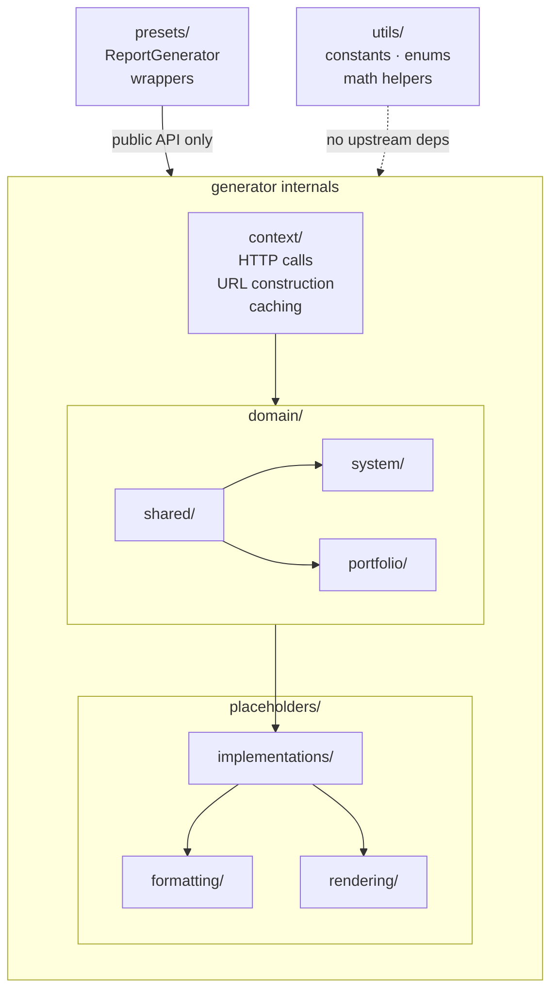

# Architecture

## Overview

The architecture separates *what data Sigrid exposes* from *how that data is presented in a report*. This allows the
domain layer to be used independently by other tools (e.g., to build custom placeholders), and keeps pptx/docx mechanics
out of business logic. The dependency rules in `sigrid.yaml` and `import-linter` enforce these boundaries mechanically.

---

## Mental model: data flows one way

```
context → domain → placeholders → rendering
```

| Stage | Responsibility |
|---|---|
| `context` | Raw API access: HTTP calls, URL construction, caching, global config |
| `domain` | Semantic meaning: domain objects with computed properties over raw API data |
| `placeholders` | Report content: maps domain values to template keys, applies presentation logic |
| `rendering` | File mechanics: writes values into pptx/docx structures |

**The direction is never reversed.** Domain does not know placeholders exist.
Each layer depends only on the layers to its left.



---

## Layer-by-layer reference

### `context/` (`generator/context/`)

**Purpose:** global state and raw API access.

- Makes all Sigrid HTTP requests; constructs URLs; applies `@cache` to avoid redundant calls
- Returns raw JSON; no interpretation, no transformation

**Does NOT:** parse or reshape API responses; apply any domain meaning to the data returned.

### `domain/` (`generator/domain/`)

**Purpose:** give semantic meaning to raw API data.

- Wraps context calls with lazy-loaded, cached domain objects (module-level singletons)
- Performs **domain-level transformations**: transformations that are meaningful in terms of the Sigrid data model.
  E.g., sorting technologies by volume, aggregating small tech categories, computing weighted-average ratings
- These transformations are reusable across any presentation context

**Does NOT:** produce human-readable strings, star symbols, color codes, or anything tied to how data looks in a
report. If a computation requires knowing what a report looks like, it belongs in `placeholders/`, not here.

**Sub-structure:**
- `system/` — domain objects for a single system
- `portfolio/` — domain objects spanning a whole customer portfolio
- `shared/` — logic shared between `system/` and `portfolio/`

`system/` and `portfolio/` must not depend on each other.

### `placeholders/implementations/` (`generator/placeholders/implementations/`)

**Purpose:** bridge domain and rendering; define what goes into the report.

- Defines the placeholder `key` that appears in a template (e.g., `MAINT_RATING`)
- Calls domain objects for raw values; applies **presentation-level transformations** to produce the final value
- Each placeholder is responsible for one thing in one place in a template
- Calls `formatting/` for shared presentation helpers; calls `rendering/` to write to the file

### `placeholders/formatting/` (`generator/placeholders/formatting/`)

**Purpose:** presentation-level transformations. This turns domain values into the format for the report.

- Converts floats to star strings, ratios to percentage strings, diffs to `+0.3` notation
- Generates "smart remark" sentences
- Shared across multiple placeholder implementations

**Does NOT:** touch pptx/docx objects. Purely data-in, string/value-out.

### `placeholders/rendering/` (`generator/placeholders/rendering/`)

**Purpose:** pptx/docx file mechanics.

- Knows how pptx/docx files are structured: how to find a text run, replace text in a paragraph, update chart data,
  manipulate table rows
- Has **no knowledge of Sigrid data** or what the values mean

**Does NOT:** call domain objects or formatting helpers. It is called from `implementations/`, never the reverse.

### `utils/` (`generator/utils/`)

**Purpose:** pure, stateless helpers with no dependency on the rest of the codebase.

- Constants, enum definitions, star-rating math, time/period arithmetic

**Rule of thumb:** if it needs to know what a Sigrid API response looks like, it belongs in `domain/`, not `utils/`.
`utils/` must not import anything from `domain/`, `placeholders/`, or `context/`.

### `presets/`

**Purpose:** named report configurations for end-users.

- Each preset is a thin wrapper: `ReportGenerator(template) → generate(output)`
- Depends on the public `ReportGenerator` API only — never on generator internals

`generator/` internals must not depend on `presets/`. Presets are consumers of the package, not part of it.